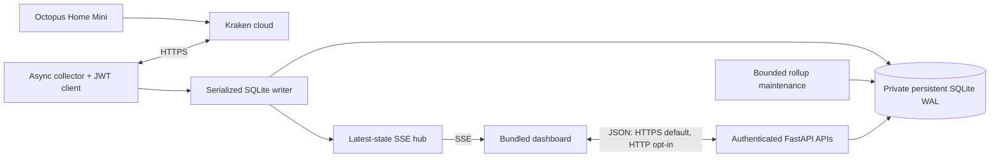

# Architecture

One process owns the collector, upstream token cache, bounded session cache, SSE hub and SQLite writer. Dashboard sessions are persisted in SQLite and restored into the cache on startup. FastAPI lifespan starts and supervises background tasks. The production entry point shuts the server down on unexpected worker termination rather than presenting a silently dead collector.

Browser transport defaults to HTTPS. Explicit `APP_TRANSPORT=http` enables certificate-free trusted-LAN HTTP without changing the upstream Kraken HTTPS connection. HTTP retains password/CSRF/Host/Origin checks but cannot protect credentials or session cookies from network interception. The internal listener stays on port 8443 in either mode; the health probe follows the selected transport.

Authentication is independently controlled by `APP_AUTH_REQUIRED`, default `true`. Explicit `false` skips password bootstrap and the password watcher, exposes the dashboard/API without login, and revokes persisted sessions while preserving any existing password hash. The frontend obtains a process-local CSRF token without creating an authentication session; writes still require that token and a trusted Origin. The HTTP Portainer stack explicitly disables login and mounts only the data directory.

## Data flow

The collector retrieves an overlapping `TEN_SECONDS` window at a default 45-second interval. It validates native timestamps/units and idempotently upserts every returned reading, including corrections. Equivalent timestamp offsets normalize to one UTC key. Config revisions fence off in-flight results after device/key/toggle changes.

Raw changes mark affected five-minute buckets dirty, including the maximum supported adjacent-segment range. Maintenance atomically rebuilds each bucket's coverage, energy, sampled peak and three threshold aggregates. Derived rollups can be regenerated; raw readings are never automatically deleted.

One writer lock serializes configuration, ingestion and maintenance. Two fixed read connections serve consistent snapshots. WAL allows concurrent readers/one writer, not unlimited writers. Query deadlines/cancellation interrupt SQLite work before returning a connection to its pool.

Historical queries stream indexed rollups and recompute exact raw boundary/dirty fragments. One-minute views use a bounded raw window. Each response contains at most 2,000 buckets. A large dirty rebuild returns an explicit retryable state rather than serving stale cached metrics.

SSE sends complete state snapshots. Each subscriber has one replaceable pending state; reconnects receive current state, not a durable event replay. The browser refetches history separately. Heartbeats and session checks run even without new readings.

## Implementation layout

- `backend/app/main.py`: app lifecycle, routes, middleware, supervised production entry point.
- `settings.py`, `auth.py`, `api_models.py`, `models.py`: validated configuration, local sessions, public schemas and telemetry normalization.
- `kraken.py`, `poller.py`, `streaming.py`: upstream operations, recovery scheduling and bounded live delivery.
- `db/store.py`, `db/migrations/*.sql`: migrations, private WAL storage, persisted sessions, configuration/readings and rollup maintenance.
- `analytics/intervals.py`, `analytics/service.py`: one shared calculation definition and range aggregation.
- `cli.py`, `healthcheck.py`: operational utilities and transport-aware liveness probe that validates certificates in HTTPS mode.
- `frontend/src`: typed vanilla UI, uPlot charts and bundled CSS.
- `tests`: unit/integration tests, synthetic browser server and resource workloads.

The original plan's many small routing/client modules are consolidated where a single module is clearer; there is no parallel implementation of interval mathematics. The dashboard is a compact single-page layout rather than a full router/framework.

The Content Security Policy permits inline styles for uPlot's dynamic canvas positioning, but no inline scripts or third-party assets. This is a deliberate chart-library compatibility exception, not permission to render upstream HTML.

## Authentication and errors

With login enabled, only the login shell and minimal health endpoints are public. JSON/SSE require an opaque cookie session. Settings/test/logout require CSRF plus trusted Origin. Password verification uses versioned PBKDF2-HMAC-SHA256 hashes; sessions and login limiter state are bounded. A password reset invalidates running sessions within 15 seconds. Password-free mode removes the session requirement, not the Host/Origin/CSRF checks.

Keys are stored only in the private database. JWTs remain in process memory and refresh single-flight. GraphQL HTTP 200 errors are classified alongside HTTP 401/429/5xx. Failed or partial upstream responses are never treated as healthy collection. Retry timing is shared with connectivity tests.

The UI reports stream connectivity separately from collector health and native-reading freshness. File/database errors are explicit; no automatic corrupt-database replacement or raw-data deletion is attempted.
