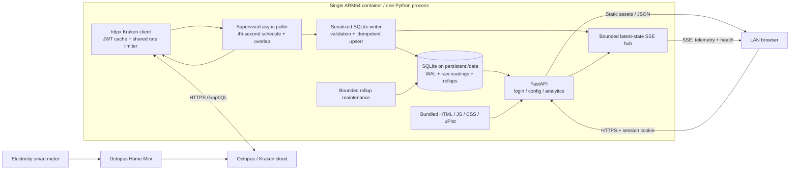

# Home electricity monitoring: detailed implementation plan and technical specification

## 1. Outcome, scope and decisions

Build a lightweight, self-hosted electricity monitoring application for Raspberry Pi OS 64-bit/Linux ARM64. One Docker container runs one Python process: FastAPI serves an embedded static dashboard and a supervised asynchronous poller retrieves Octopus Home Mini telemetry through Kraken. SQLite holds configuration, meter readings and rebuildable analytical rollups.

The repository began as a greenfield project. This document preserves the approved design; the implementation is now in the repository. See `architecture.md` for the actual consolidated layout, `deployment.md` for setup, and `validation.md` for completed checks and outstanding provider/hardware acceptance gates.

### Confirmed choices

| Area | Decision |
|---|---|
| Backend | Python/FastAPI, `aiosqlite`, `httpx`; no ORM |
| Deployment | One container, one uvicorn worker, native Linux ARM64 support |
| Dashboard access | Home LAN, dashboard password, HTTPS using a locally trusted certificate |
| Telemetry identity | Composite primary key using device ID and native `readAt`; one active device at a time |
| Meter replacement | Keep previous device history isolated; never merge different meters silently |
| Storage retention | Retain all raw readings; analytical rollups are disposable/rebuildable |
| Threshold analysis | Show both all energy during above-threshold periods and only the energy exceeding the inverter rating |
| Missing data | Report observed coverage explicitly; missing telemetry is not zero demand |

### Proposed implementation defaults

These are explicit design defaults, not claims about Kraken guarantees:

| Setting | Default / bound |
|---|---|
| Polling | Disabled until credentials/device are configured; 45 seconds when enabled |
| Poll interval configuration | 30-3,600 seconds; vendor throttling can lengthen the effective interval |
| Retrieval granularity | Kraken `TEN_SECONDS`, subject to authenticated semantic verification |
| Overlap | 180 seconds to recover delayed/out-of-order readings |
| Reconnection retrieval | At most the most recent hour per request; older gaps remain visible |
| Maximum gap eligible for demand integration | 30 seconds between valid adjacent samples |
| Stale display | Native reading age above `max(120 seconds, 3 * polling interval)` |
| Time zone | `Europe/London` for calendar days; UTC storage |
| Fixed inverter thresholds | 3,680 W, 5,000 W and 6,000 W |
| Historical output | Target 1,500 buckets; hard limit 2,000 buckets |
| Historical request span | At most 366 days per request; older retained periods remain selectable |
| SSE clients | At most four simultaneous streams |
| Analytical concurrency | One expensive analytical request at a time, bounded waiting |
| Database connections | One writer and two read connections |
| Memory acceptance | Total container-accounted memory below 150,000,000 bytes |

### In scope

Live demand, connection/collection health, interval charts, local-day sampled peaks, trailing 15-minute average demand, threshold sizing statistics, configuration/connectivity testing, password login, migrations, backup/restore guidance, Docker deployment and ARM64 verification.

### Out of scope for the initial release

Billing-grade reconciliation, tariffs/cost forecasting, controlling batteries or inverters, battery state-of-charge simulation, multi-user roles, simultaneous multi-meter collection, arbitrary user-defined threshold sets, cloud-hosted access, Prometheus/Redis/Celery, and bulk import of years of pre-installation history.

The smart meter measures grid-side demand, not necessarily gross household demand. Solar or an existing battery can obscure the underlying household load. Preserve negative demand, where supplied, but use nonnegative import demand for the inverter-sizing calculations. Explain this limitation in the dashboard. This is a sampled sizing aid, not an electrical design or connection-approval tool; brief motor-starting surges may not be captured. The 3.68 kW preset is a familiar single-phase reference, not a determination of G98/G99 eligibility.

## 2. Architecture and data flow



1. FastAPI lifespan validates boot settings, opens SQLite, applies migrations and checks that WAL is active.
2. Load persisted configuration, the current meter's most recent reading and runtime health. Require a configured administrator password before exposing authenticated application routes.
3. Start the poller and rollup-maintenance tasks. Serve the dashboard even when Octopus is unavailable or collection is disabled.
4. A poll captures an immutable configuration revision and uses the shared Kraken client to obtain/refresh a token and query a recent telemetry window.
5. Validate each returned row, parse its native timestamp, normalize units, and write a bounded batch in one transaction. Advance the device data version only if readings really change.
6. That transaction also invalidates affected rollup buckets. Only after commit, publish a complete current-state snapshot to the SSE hub.
7. Maintenance rebuilds dirty buckets in short, serialized transactions. Historical APIs combine clean rollups with bounded raw-data work for unfinished buckets and exact boundary fragments.
8. The browser displays live state through one `EventSource`; it requests historical JSON only on range changes and throttled data-version updates.
9. On shutdown, stop scheduling, cancel or finish bounded network work, drain the current transaction, close streams, checkpoint when safe, and close connections. Unexpected background-task failure must be surfaced and terminate the process rather than leave a silently dead poller.

No browser communicates with Kraken. API keys and Kraken tokens never enter HTML, local storage, SSE payloads or public API responses.

### Runtime stack

- Python 3.12, using an explicitly pinned, supported patch/base-image digest at implementation time.
- A tested, locked FastAPI version **at least 0.135.0**, which has native `fastapi.sse.EventSourceResponse` and `ServerSentEvent`.
- Plain `uvicorn` with its lightweight HTTP implementation; do not add its full optional extras without demonstrated need.
- `httpx.AsyncClient` with connection reuse, TLS verification and bounded connection counts.
- `aiosqlite`; standard-library `sqlite3`, `zoneinfo`, `decimal`, `hashlib` and `secrets` where appropriate.
- Vanilla TypeScript, Vite and uPlot, with a small locally bundled CSS stylesheet. No Vue runtime or Tailwind CDN is needed for three views.
- Pinned production and development dependency locks. Build tools, test tools and Node do not ship in the final image.

## 3. Kraken integration contract

### Verified public facts and remaining gate

The live public schema was inspected without supplying credentials:

- `smartMeterTelemetry(deviceId: String!, start: DateTime, end: DateTime, grouping: TelemetryGrouping)` returns a list.
- Supplying a range requires **all three** of `start`, `end` and `grouping`. Start is inclusive and end is exclusive.
- Groupings include `TEN_SECONDS`, `ONE_MINUTE`, `FIVE_MINUTES`, `HALF_HOURLY` and `HOURLY`.
- Telemetry fields include `readAt`, `demand` in W, cumulative `consumption` in Wh, cumulative `export` in Wh and `consumptionDelta` in Wh.
- JWT renewal is another call to **`obtainKrakenToken` with `refreshToken` input**, not an assumed `refreshKrakenToken` mutation.
- `refreshExpiresIn` is documented as a **Unix expiry timestamp**, despite its name.
- GraphQL failures commonly arrive as HTTP 200 plus an `errors` array.
- The telemetry field documents its own throttle error, `KT-GB-4042`, in addition to general request-limit error `KT-CT-1199`.

**Important semantic gate:** the range argument describes representative group values as means, while the `readAt` field description refers to a maximum reading within a period. Public metadata does not establish precise sampled/aggregated peak semantics. Before marking the implementation production-ready, perform a credentialed, read-only test against the user's device, verify the accepted authorization header, field availability, grouping behavior, sampling cadence, timestamp semantics and usable lookback. Compare range results with the live reading/app over representative load changes. Record unresolved ambiguity as a visible data-quality limitation; do not advertise continuous instantaneous peaks or billing-grade energy.

No credentials are needed to write this plan. The authenticated acceptance check remains outstanding.

### GraphQL operations

Use named operations and variables, never string interpolation of secrets:

```graphql
mutation ObtainToken($input: ObtainJSONWebTokenInput!) {
  obtainKrakenToken(input: $input) {
    token
    payload
    refreshToken
    refreshExpiresIn
  }
}
```

Initial variables contain only `{"input":{"APIKey":"<server-side secret>"}}`.
Refresh variables contain only `{"input":{"refreshToken":"<memory-only token>"}}`.
Do not combine API key and refresh token in one input.

```graphql
query HouseholdTelemetry(
  $deviceId: String!
  $start: DateTime!
  $end: DateTime!
  $grouping: TelemetryGrouping!
) {
  smartMeterTelemetry(
    deviceId: $deviceId
    start: $start
    end: $end
    grouping: $grouping
  ) {
    readAt
    demand
    consumption
    export
  }
}
```

Use `Authorization: JWT <token>` as the initial compatibility contract and confirm it in the authenticated integration check. The older community integration demonstrates this form; the current schema simply describes use of the token in the authorization header.

Device discovery uses the account's electricity meter/smart-device relationship, verified against the current account schema during implementation. The relevant ID is the electricity smart meter EUI-64, not the physical Home Mini's label/serial number and not the account number. Show all accessible electricity candidates and require a selection when ambiguous. Validate that a manually entered device belongs to the selected account; do not auto-select a gas device or the first of several meters.

### Polling algorithm

1. Schedule using a monotonic clock; collection is independent of dashboard connections.
2. With no stored reading, request `[now - 180 seconds, now)`. Otherwise request from the later of `latest_read_at - 180 seconds` and `now - 1 hour`, up to now.
3. Request only `TEN_SECONDS`. This can retrieve roughly 18 samples in a normal overlapping window and 360 during one-hour recovery without polling every 10 seconds.
4. Sort by parsed native timestamp; never assume the first result is newest. Ingest every valid timestamped row, not just the latest.
5. Repeated identical responses do not create database writes, rollup rebuilds or artificial freshness. A valid zero is a measurement, not missing data.
6. Never insert the same period at several Kraken grouping levels into the raw table. That would combine incompatible measurements under timestamp keys.
7. Apply updates when the same native timestamp genuinely gains/corrects field values. Identical retries are no-ops.
8. When configuration changes, cancel obsolete requests if possible and recheck the configuration revision immediately before committing. Discard results from superseded configurations.
9. Disabling polling prevents new calls, cancels outstanding collection and rejects any obsolete result before its commit. An already committed batch remains valid history.
10. After long outages, retrieve only the supported recent window. Mark older gaps explicitly. On `KT-GB-4051` (range too old), make at most one deferred shorter-window attempt, expose the incomplete recovery, and avoid a tight retry loop.

Polling every 45 seconds means approximately 80 telemetry requests per hour, not 80 individual samples. Actual field quotas and complexity remain separate constraints.

### Authentication and quota management

- One token manager per active credential set, with a single-flight `asyncio.Lock`; no concurrent refresh storm.
- Keep access and refresh tokens only in process memory. Read expiry from the response payload or decoded JWT strictly as a scheduling hint, not as locally verified authentication.
- Refresh before the next request if expiry is within the larger of 60 seconds and the request timeout, capped appropriately for unusually short-lived tokens. Do not hardcode an assumed one-hour access-token lifetime.
- If proactive refresh suffers a transient network error, retain an access token only while it is still valid; obey the same retry governor.
- On HTTP 401 or an explicitly classified token-expired/invalid GraphQL error, invalidate the token and allow one refresh/re-authentication plus one retry of the operation. Repeated failure enters `auth_error`, stops the authentication loop and requires a configuration change or deliberate connectivity test.
- An invalid/expired refresh token permits one API-key exchange. Invalid API keys, denied account access and wrong-device authorization are not treated as endlessly retryable token expiry.
- Parse GraphQL codes, error type and paths using verified mappings. Do not string-match every error message or map all authorization failures to token expiry.
- Query `rateLimitInfo` sparingly during diagnostics/startup and after relevant throttling, subject to the same governor; do not request it on every poll.
- Current documentation describes a 200-point per-query complexity ceiling, default 50,000 points/hour for account users and a 10,000-node query ceiling. These are current documented defaults, not fixed application entitlements.
- The selected telemetry query has its own rate limit, and other integrations may share the same account allowance. Display the effective next attempt and any known quota information.

## 4. SQLite schema, identity and concurrency

### Timestamp and unit contract

`read_at` is a canonical UTC ISO-8601 representation of the upstream `readAt`, with consistent microsecond precision. Preserve the exact upstream string in `source_read_at`. No polling/ingestion timestamp may replace the native time in the primary key.

`read_at_us` is the same instant expressed as integer Unix microseconds for indexed comparisons. Parse timezone-aware timestamps, normalize offsets, reject malformed/nonfinite values and timestamps beyond supported precision rather than silently rounding distinct instants together. Equivalent `Z`/offset spellings deduplicate to the same key.

Use `Decimal` at the ingestion boundary, then integer milliWatts and milliWatt-hours, rounding once to the declared storage precision. Return public API power values in W and energy in kWh. Preserve signed demand; counters are nullable, cumulative and nonnegative.

### Initial migration

```sql
CREATE TABLE devices (
    device_id TEXT PRIMARY KEY,
    account_number TEXT NOT NULL,
    label TEXT NOT NULL,
    created_at_us INTEGER NOT NULL,
    data_version INTEGER NOT NULL DEFAULT 0,
    CHECK (data_version >= 0)
) STRICT;

CREATE TABLE app_config (
    singleton INTEGER PRIMARY KEY CHECK (singleton = 1),
    revision INTEGER NOT NULL DEFAULT 1,
    account_number TEXT,
    active_device_id TEXT REFERENCES devices(device_id),
    octopus_api_key TEXT,
    polling_enabled INTEGER NOT NULL DEFAULT 0
        CHECK (polling_enabled IN (0, 1)),
    poll_interval_seconds INTEGER NOT NULL DEFAULT 45
        CHECK (poll_interval_seconds BETWEEN 30 AND 3600),
    display_timezone TEXT NOT NULL DEFAULT 'Europe/London',
    updated_at_us INTEGER NOT NULL
) STRICT;

CREATE TABLE admin_auth (
    singleton INTEGER PRIMARY KEY CHECK (singleton = 1),
    password_hash TEXT NOT NULL,
    updated_at_us INTEGER NOT NULL
) STRICT;

CREATE TABLE readings (
    device_id TEXT NOT NULL REFERENCES devices(device_id),
    read_at TEXT NOT NULL,
    source_read_at TEXT NOT NULL,
    read_at_us INTEGER NOT NULL,
    demand_mw INTEGER,
    consumption_mwh INTEGER CHECK (
        consumption_mwh IS NULL OR consumption_mwh >= 0
    ),
    export_mwh INTEGER CHECK (
        export_mwh IS NULL OR export_mwh >= 0
    ),
    quality TEXT NOT NULL
        CHECK (quality IN ('valid', 'missing_demand', 'invalid_demand')),
    first_received_at_us INTEGER NOT NULL,
    updated_at_us INTEGER NOT NULL,
    PRIMARY KEY (device_id, read_at),
    CHECK (
        (quality = 'valid' AND demand_mw IS NOT NULL)
        OR (quality <> 'valid' AND demand_mw IS NULL)
    )
) STRICT, WITHOUT ROWID;

CREATE UNIQUE INDEX idx_readings_device_time
    ON readings (device_id, read_at_us);

CREATE TABLE rollup_5m (
    device_id TEXT NOT NULL REFERENCES devices(device_id),
    bucket_start_us INTEGER NOT NULL,
    algorithm_version INTEGER NOT NULL,
    observed_us INTEGER NOT NULL
        CHECK (observed_us BETWEEN 0 AND 300000000),
    import_watt_seconds REAL NOT NULL
        CHECK (import_watt_seconds >= 0),
    sample_count INTEGER NOT NULL CHECK (sample_count >= 0),
    invalid_sample_count INTEGER NOT NULL CHECK (invalid_sample_count >= 0),
    peak_import_mw INTEGER,
    peak_at_us INTEGER,
    updated_at_us INTEGER NOT NULL,
    PRIMARY KEY (device_id, bucket_start_us),
    CHECK (bucket_start_us % 300000000 = 0)
) STRICT, WITHOUT ROWID;

CREATE TABLE rollup_threshold_5m (
    device_id TEXT NOT NULL,
    bucket_start_us INTEGER NOT NULL,
    threshold_w INTEGER NOT NULL CHECK (threshold_w IN (3680, 5000, 6000)),
    above_us INTEGER NOT NULL CHECK (above_us BETWEEN 0 AND 300000000),
    load_above_watt_seconds REAL NOT NULL
        CHECK (load_above_watt_seconds >= 0),
    excess_watt_seconds REAL NOT NULL
        CHECK (excess_watt_seconds >= 0),
    PRIMARY KEY (device_id, bucket_start_us, threshold_w),
    FOREIGN KEY (device_id, bucket_start_us)
        REFERENCES rollup_5m(device_id, bucket_start_us) ON DELETE CASCADE
) STRICT, WITHOUT ROWID;

CREATE TABLE dirty_rollup_buckets (
    device_id TEXT NOT NULL REFERENCES devices(device_id),
    bucket_start_us INTEGER NOT NULL,
    PRIMARY KEY (device_id, bucket_start_us)
) STRICT, WITHOUT ROWID;
```

The composite primary keys already index rollup device/time access. Do not add redundant standalone timestamp indexes. The unique raw time index also guards against accidentally persisting two representations of the same device instant.

Store schema migration level with `PRAGMA user_version`; use ordered, transactional SQL migrations and reject databases created by a newer incompatible application. Require a SQLite build supporting STRICT tables and the chosen window functions; verify the actual runtime version in the built image.

### Connection configuration

Apply connection-specific PRAGMAs to every connection, not just during schema creation:

```sql
PRAGMA journal_mode = WAL;
PRAGMA foreign_keys = ON;
PRAGMA busy_timeout = 2500;
PRAGMA synchronous = FULL;
PRAGMA temp_store = FILE;
PRAGMA mmap_size = 0;
PRAGMA wal_autocheckpoint = 1000;
PRAGMA journal_size_limit = 16777216;
```

- Set writer `cache_size = -4096` and each reader `cache_size = -2048`: approximately 8 MiB aggregate configured page cache.
- Enable `query_only = ON` on the reader connections after their connection setup.
- Check that the journal mode actually returns `wal`.
- Choose `FULL` initially to favour committed-reading durability during Pi power loss. `NORMAL` is a future, explicit durability/SD-write trade-off, not a hidden optimization.
- WAL allows readers alongside a writer; it does **not** remove all lock contention or permit concurrent writers.
- Serialize all writes with one repository lock and writer connection. Use short `BEGIN IMMEDIATE` transactions and bounded busy retries.
- Use two fixed reader connections, not one connection per HTTP request/SSE client.
- Avoid network calls, SSE waiting and large Python processing while holding transactions.
- Use periodic passive checkpoints; monitor database/WAL size. `journal_size_limit` is not a hard cap on an active WAL.
- Keep read transactions short so they cannot indefinitely block checkpoint completion. Do not truncate/checkpoint synchronously on every poll.
- Store the database, WAL and SHM together on the same local persistent volume, never NFS/SMB.

### Idempotency, corrections and rollup invalidation

Upsert on `(device_id, read_at)` and update only when normalized source fields or quality change. Preserve `first_received_at_us`; do not update merely because a duplicate was received again.

For any inserted/corrected timestamp, find its predecessor and successor. Mark every bucket whose supported segment, sample peak or trailing-boundary calculation could change. Include buckets on both sides of a boundary; invalid/previously absent samples can split or remove an interval.

Recompute complete dirty five-minute buckets from authoritative raw readings plus the immediately adjacent boundary samples. Rebuilding must include intervals crossing a bucket even when neither endpoint lies inside that bucket.

The maintenance task processes a bounded number of dirty buckets per pass, with each small bucket rebuild committed independently. Calculate and replace the base and all three threshold rows atomically, then remove that bucket's dirty marker. The serialized writer prevents a new raw-data change from being lost between computation and clearing the marker.

Analytical reads use a consistent database snapshot. Never serve a dirty or wrong-algorithm-version rollup as current. Recompute bounded dirty spans from raw data for the response; if a large rebuild exceeds the query budget, respond with an explicit retryable `analytics_rebuilding` error and show that state in the UI.

Rollup schema/algorithm changes enqueue bounded rebuild batches and yield between them. No in-memory queue proportional to all retained history.

### Storage growth and backups

Ten-second telemetry can produce 3,153,600 raw rows in a 365-day year. Five-minute rollups add 105,120 base rows and 315,360 threshold rows. Text timestamp keys and the time index have meaningful overhead.

Use **roughly 1-2 GB/year as an initial capacity allowance**, not a measured guarantee. Seed a representative database, measure actual bytes per row/index and publish the resulting estimate. Monitor free disk and database/WAL sizes. Recommend a suitable SSD/high-endurance card and adequate free space.

Raw retention is indefinite: never auto-delete old readings to fix disk pressure. Report low disk space; on exhausted storage, stop declaring successful ingestion and expose `storage_error`.

Use SQLite's backup API to create a transactionally consistent backup. Do not simply copy the database file while leaving live WAL data behind. Document a quiesced backup option for installations without enough headroom for online backup. Backups contain the API key/password hash and must be protected; provide restore and `quick_check`/`integrity_check` procedures.

## 5. Analytics: precise definitions and efficient execution

### Supported intervals and missing data

For adjacent readings at times `t_i` and `t_(i+1)`, use piecewise-constant demand from the earlier reading over the half-open interval between them only when:

- Both bounding samples have valid demand.
- The interval is positive and no more than 30 seconds.
- Both readings belong to the same device and measurement series.

Otherwise the interval is unknown. Do not extend a reading through a long dropout, interpolate across missing values or extrapolate the final reading up to the current time. A final valid sample can contribute to the sampled peak before a following sample makes its duration measurable.

Split supported intervals at query boundaries, five-minute bucket boundaries and local calendar-day boundaries. Fetch predecessor/successor context so clipping does not discard supported data at the edges.

The 30-second maximum gap is derived from the expected source cadence, not the poll interval. If authenticated verification shows another cadence, revise this constant, tests and rollup algorithm version before release. Source granularity and supported-gap policy are returned as metadata.

### Energy and threshold definitions

Let `p_i` be nonnegative import demand in W for a supported interval and let `d_i` be its clipped duration in seconds. Let `T` be an inverter threshold in W and `D` total observed seconds.

$$
D = \sum_i d_i,\qquad
E_{\mathrm{import}} = \frac{\sum_i p_i d_i}{3{,}600{,}000}
$$

$$
\mathrm{timeAbovePct}(T) =
100 \frac{\sum_i d_i\,\mathbf{1}[p_i > T]}{D}
$$

$$
E_{\mathrm{loadAbove}}(T) =
\frac{\sum_i p_i d_i\,\mathbf{1}[p_i > T]}{3{,}600{,}000},
\qquad
E_{\mathrm{excess}}(T) =
\frac{\sum_i \max(p_i-T,0)d_i}{3{,}600{,}000}
$$

All energy results above are kWh. Threshold comparison is strictly `>`: demand exactly at 3,680 W does not exceed 3,680 W.

- `time_above_pct` uses observed time, not sample count and not total requested wall-clock time.
- `coverage_pct` is observed seconds divided by requested elapsed seconds.
- `energy_when_above_kwh` is all household import energy during above-threshold intervals.
- `excess_energy_kwh` is the estimated portion that an ideal inverter capped at the threshold could not meet.
- Sum/weight by actual duration, including irregular sample spacing.
- When there is no observed duration, return null for energy/percentage/average estimates, zero observed seconds and explicit insufficient-data metadata.
- Zero exceedance with valid coverage is a real zero, not null.
- Cumulative consumption counters are never summed. Store them for display and optional independent sanity checking; counter reset/wrap or missing endpoints must not produce negative energy.
- A future counter-delta comparison must remain a separately labelled measurement, not silently replace demand-integrated threshold calculations.

**Reference arithmetic fixture:** 120 fully observed seconds at 4,000 W, threshold 3,680 W, produces 100% above-threshold time, 0.133333333 kWh energy while above, and 0.010666667 kWh excess energy. This fixture consists of valid samples at the source cadence, not one unsupported 120-second gap.

### Daily peaks and trailing demand

- Daily peak is the maximum valid **sampled import demand** within that local day; return W, timestamp, sample count and coverage. Ties use the earliest timestamp.
- Calculate local-day boundaries with `zoneinfo`. UK daylight-saving days can have 23 or 25 hours; never assume 86,400 seconds for every calendar day.
- A daily peak can be present even when energy coverage is poor; always show its coverage context.
- Trailing 15-minute demand at an output time is the import-energy integral over the preceding 900 seconds divided by 900.
- Emit a non-null full-window rolling mean only with complete supported coverage of those 900 seconds; otherwise return null plus rolling-window coverage.
- Retrieve at least 15 minutes of lookback plus bounding samples even when the chart itself begins later.
- Compute rolling demand from the original supported intervals or exact rollup integrals, never by averaging an arbitrary number of sparse samples.
- Render the rolling curve at each returned bucket's end. Expose the evaluation cadence so coarse charts do not imply a point every minute.

### Rollup and downsampling strategy

The five-minute cache stores observed duration, the integral of import demand, sampled peaks and the three threshold integrals/durations. Threshold metrics must be computed **before** chart downsampling; an average below a rating can hide substantial time above it.

1. Short/high-resolution ranges use indexed raw readings and bounded interval aggregation.
2. Longer ranges sum complete five-minute rollups. Recalculate only partially included edge buckets, dirty buckets and the necessary rolling-window context from raw readings.
3. Sum energy/duration; compute weighted means from totals; take peaks from stored sampled maxima. Never average averages without their observed-duration weights.
4. For trailing windows, use time-based ranges or indexed interval lookups, not SQL `ROWS` windows that would bridge missing buckets.
5. Return explicit null/coverage values for empty/partial output buckets. A partial bucket mean is an observed-time mean, not a claim about the whole interval; the UI must mark it as incomplete.
6. Include a peak series/envelope as well as mean demand so downsampling does not hide short high-demand events.
7. Avoid a `fetchall()` of raw history or a Python object per retained reading. Use SQL aggregation and bounded `fetchmany()` work, with at most 2,000 final chart buckets.
8. Use indexed device/time scans; verify query plans. Offload any substantial CPU-only transformation to a bounded worker thread rather than block the async event loop.
9. Enforce an analytical concurrency semaphore, a bounded waiting period and a cancellable query deadline. Interrupt cancelled/timed-out SQLite work and do not return its connection to the pool until the worker has actually finished.

Intervals: `auto`, `1m`, `5m`, `15m`, `30m`, `1h`, `6h`, `1d`. For history, `1d` means a fixed UTC-aligned 24-hour chart bucket; local-calendar daily peaks are a separate summary series.

For `auto`, choose the smallest interval meeting `max_points` from the allowed set. Examples with a 1,500-point target: 24h -> 1m, 7d -> 15m, 30d -> 30m, 365d -> 6h. Explicit incompatible interval/point-limit requests return 422 with a suggested interval instead of silently changing meaning.

UTC bucket boundaries are stable between requests. Edge buckets report their actual clipped start/end and duration. Timezone formatting happens in the browser; summary calendar grouping uses the requested valid IANA timezone.

## 6. HTTP API specification

### Common contract

- Same-origin JSON and SSE, under HTTPS.
- All application/configuration/telemetry/analytics endpoints require an authenticated session. Only login assets and minimal health endpoints are public.
- Request/response models use Pydantic with unknown configuration fields forbidden and explicit range/size limits.
- Accept RFC 3339 timestamps with timezone offsets; normalize to UTC and return `Z` timestamps. All requested intervals are half-open `[from,to)`.
- Power fields end in `_w`; energy fields end in `_kwh`; percentages use 0-100.
- Reject reversed ranges, unsupported timezones, invalid timestamps, nonfinite numbers, disallowed devices and excessive spans. Never quietly clamp an invalid request.
- Use `application/problem+json` errors with `type`, `title`, `status`, `code`, safe `detail`, `request_id` and optional validation/retry metadata.
- Codes: 401 session required/expired; 403 CSRF/access denial; 409 configuration revision conflict; 422 validation; 429 local/upstream throttling with `Retry-After`; 502 malformed/upstream contract failure; 503 storage unavailable, upstream unavailable, analytics busy/rebuilding; 504 analytical deadline.
- Upstream credential failures in a connectivity test return a validation-style safe error, not 401 that would incorrectly log the user out of the dashboard.
- Bound ordinary JSON request bodies to 16 KiB and Kraken responses to 1 MiB; reject oversized responses before unbounded parsing.

### Endpoint inventory

| Method / endpoint | Purpose |
|---|---|
| `POST /api/auth/login` | Verify password, issue secure session cookie |
| `GET /api/auth/session` | Read authenticated state and obtain CSRF token |
| `POST /api/auth/logout` | Revoke session and close associated streams |
| `GET /api/config` | Redacted configuration, revision and known device labels |
| `POST /api/config` | Validate and persist partial configuration changes |
| `POST /api/config/test` | Test saved or draft settings without saving/enabling collection |
| `GET /api/telemetry/live` | Authenticated SSE latest state and health |
| `GET /api/analytics/summary` | Coverage, integrated import, daily peaks, fixed-threshold metrics |
| `GET /api/analytics/history` | Bounded chart buckets and trailing 15-minute curve |
| `GET /healthz` | Process/event-loop liveness; no secrets |
| `GET /readyz` | Startup/migration/storage readiness, not Kraken availability |

### Configuration

Example `GET /api/config`:

```json
{
  "revision": 4,
  "account_number": "A-EXAMPLE",
  "active_device_id": "AA-BB-CC-DD-EE-FF-00-11",
  "has_api_key": true,
  "polling_enabled": true,
  "poll_interval_seconds": 45,
  "display_timezone": "Europe/London",
  "thresholds_w": [3680, 5000, 6000],
  "devices": [
    {
      "device_id": "AA-BB-CC-DD-EE-FF-00-11",
      "label": "Electricity meter"
    }
  ]
}
```

Never include the actual API key, token, password hash or bootstrap secret. There is no need even to return the last four characters of the key.

Example `POST /api/config`:

```json
{
  "expected_revision": 4,
  "polling_enabled": true,
  "poll_interval_seconds": 45,
  "display_timezone": "Europe/London"
}
```

Additional writable fields are `account_number`, `active_device_id` and `api_key`. Omitted key means preserve; a nonempty string means replace; explicit null means clear, permitted only when the resulting configuration has polling disabled. Empty strings are invalid.

Validate the resulting complete configuration atomically. Saving valid syntax does not silently run a connectivity test. Return 200 with the redacted new configuration/revision, or 409 on stale `expected_revision`. Switching devices changes the default analytical scope and emits a state snapshot; historical device IDs remain selectable.

`POST /api/config/test` accepts optional draft account/device/key fields; omitted values use the saved configuration. Draft secrets remain request-local. It authenticates, verifies/discovers electricity devices and retrieves a small recent telemetry window. Return:

```json
{
  "ok": true,
  "authenticated": true,
  "device_accessible": true,
  "telemetry_available": true,
  "latest_read_at": "2026-10-03T18:50:00Z",
  "latency_ms": 420,
  "devices": [],
  "warnings": []
}
```

An accessible meter with no recent data is a successful connection test with `telemetry_available:false` and a visible warning, not proof that ingestion is healthy. Device discovery with no selected device returns candidates and a selection-required state rather than a misleading successful telemetry test.

Tests have no persistent configuration/readings side effects, use the shared field-rate governor and are single-flight. If the telemetry budget is unavailable, return an explicit retry time rather than bypass the governor. Redact upstream error bodies and GraphQL variables from logs.

### Live SSE

`GET /api/telemetry/live` returns `text/event-stream` with no caching and no proxy buffering. Use FastAPI's native ping comments (15-second idle heartbeat); set the reconnect retry to 5 seconds.

On connection, send a complete snapshot immediately. Subsequent `snapshot` events carry the latest telemetry and health together, avoiding ordering dependencies between separate channels:

```text
id: boot-identifier:18
event: snapshot
retry: 5000
data: {"device_id":"AA-BB-CC-DD-EE-FF-00-11","data_version":203,"reading":{"read_at":"2026-10-03T18:50:00Z","demand_w":2475.2,"import_demand_w":2475.2},"health":{"polling_state":"running","telemetry_state":"fresh","storage_state":"ok","last_success_at":"2026-10-03T18:50:15Z","last_read_at":"2026-10-03T18:50:00Z","next_attempt_at":"2026-10-03T18:51:00Z","consecutive_failures":0}}
```

- An SSE event ID identifies a process-local state version, not a durable telemetry log. A restart changes the boot identifier.
- On reconnect, accept `Last-Event-ID` but send a fresh complete snapshot; explicitly do not promise replay of all missed events. Use historical APIs for catch-up.
- Subscribe before reading/emitting the initial current state, or use a version-aware hub operation, so a commit cannot be lost between snapshot and subscription.
- Use a one-slot latest-state queue per client; replace an obsolete pending snapshot rather than accumulating history.
- Limit to four streams; reject extra connections with 429 before streaming begins.
- Check session expiry/revocation periodically even on an otherwise idle stream; close streams on logout. Browser authentication and connection failures have distinct UI states.
- On cancellation/disconnection, remove the subscriber in `finally`. No SQLite connection or transaction is held for a stream's lifetime.
- Recompute staleness on an independent small health timer; data can become stale even when no new poll succeeds.
- The browser distinguishes stream connection, collector state, cloud errors and native-reading age. A connected SSE socket alone is not a green telemetry health signal.

### Summary analytics

`GET /api/analytics/summary?from=<RFC3339>&to=<RFC3339>&timezone=Europe%2FLondon&device_id=<optional>`

`device_id` defaults to the active device; it may select another stored device but never aggregates devices together.

Response shape:

```json
{
  "device_id": "AA-BB-CC-DD-EE-FF-00-11",
  "data_version": 203,
  "from": "2026-10-02T18:50:00Z",
  "to": "2026-10-03T18:50:00Z",
  "timezone": "Europe/London",
  "requested_seconds": 86400,
  "observed_seconds": 85000,
  "coverage_pct": 98.37963,
  "import_energy_kwh": 12.8,
  "sampled_peak_w": 6200,
  "sampled_peak_at": "2026-10-03T07:15:10Z",
  "thresholds": [
    {
      "threshold_w": 3680,
      "seconds_above": 5100,
      "time_above_pct": 6.0,
      "energy_when_above_kwh": 6.0,
      "excess_energy_kwh": 0.786666667
    }
  ],
  "daily_peaks": [],
  "method": {
    "power_basis": "nonnegative_grid_import",
    "source_grouping": "TEN_SECONDS",
    "integration": "bounded_previous_sample_hold",
    "max_gap_seconds": 30,
    "algorithm_version": 1
  },
  "warnings": []
}
```

The actual `thresholds` array always contains all three presets. Each daily entry has `date`, actual UTC start/end, requested/observed seconds, coverage, sampled peak W and its timestamp. Partial first/last local days use the clipped requested duration as their coverage denominator. Nullability follows the no-coverage rules above; example numbers illustrate the contract rather than a real household.

### Historical analytics

`GET /api/analytics/history?from=<RFC3339>&to=<RFC3339>&interval=auto&max_points=1500&device_id=<optional>`

Return bounded columnar arrays suitable for uPlot:

```json
{
  "device_id": "AA-BB-CC-DD-EE-FF-00-11",
  "data_version": 203,
  "interval_seconds": 60,
  "bucket_alignment": "UTC",
  "rolling_evaluation": "bucket_end",
  "series": {
    "bucket_start_epoch_s": [1791043200, 1791043260],
    "bucket_end_epoch_s": [1791043260, 1791043320],
    "mean_import_w": [1800, null],
    "sampled_peak_w": [4200, null],
    "peak_at_epoch_s": [1791043210, null],
    "rolling_15m_w": [2100, null],
    "observed_seconds": [60, 0],
    "coverage_pct": [100, 0],
    "rolling_15m_coverage_pct": [100, 93.333333]
  },
  "warnings": []
}
```

All arrays have equal length, ascending timestamps and a maximum of `max_points` elements. Include effective range, calculation-method metadata and any incomplete-rollup/data warnings in the full model. Bucket start/end describe clipped edges; the chart can position the rolling series at bucket ends.

Do not enable middleware that buffers/compresses SSE. If ordinary JSON gzip is needed after profiling, scope it to nonstreaming responses and account for its CPU/memory.

## 7. Local authentication and secret handling

- Bootstrap the administrator password from a mounted Docker secret on first database initialization. Hash it before storage; never return or log it. No default/admin password and no unauthenticated web setup race.
- Use standard-library PBKDF2-HMAC-SHA256 with a random per-password salt, an encoded algorithm/iteration version and an initial 600,000 iterations. Verify via constant-time comparison. Benchmark on the target Pi; serialize verification in a worker thread and do not silently lower the security work factor to meet latency goals.
- Document a local CLI password-reset command that revokes sessions. Bootstrap secrets do not overwrite an existing password hash on each restart.
- Issue cryptographically random opaque session IDs. Persist only token digests, absolute expiry and CSRF metadata in SQLite, with at most 32 sessions and a bounded in-memory cache. Routine restarts preserve sessions without extending the 12-hour expiry; logout/password reset revoke them. This supersedes the original memory-only session design.
- Limit login attempts per client and globally with bounded limiter state and generic error messages. No unlimited dictionary keyed by attacker-supplied addresses.
- Session cookie: `HttpOnly`, `Secure`, `SameSite=Strict`, path `/`, finite expiry. No bearer token in local storage or URL parameters.
- Require a session-associated CSRF token plus trusted Origin checks on configuration/test/logout mutations; protect login against cross-origin submissions too. Disable permissive CORS and validate Host against explicit allowed LAN names.
- TLS uses a locally trusted leaf certificate and its private key mounted read-only into uvicorn. Generate/trust the certificate outside the image; never copy a local CA private key into the container.
- Document hostname/IP SAN requirements and client trust installation. Do not disable certificate verification for browser or Kraken traffic.
- The Octopus API key is stored in the private SQLite volume to permit web updates and unattended restart. State clearly that filesystem permissions are not encryption at rest. The database and backups require protection; avoid cosmetic encryption with a key kept beside the database.
- Use `umask 077`, a dedicated non-root UID and a private data directory. Sanitize logs and never log password/API request bodies.
- Use a restrictive Content Security Policy with same-origin scripts/styles/connect sources. Render upstream strings as text, not HTML.

## 8. Frontend behavior

### Views

1. **Login:** password field, error state, successful redirect and expired-session handling.
2. **Live:** large demand value with W/kW display, native measurement time/age, polling state, last successful API contact, backoff retry time and storage warnings.
3. **Analysis:** 24h/7d/30d/custom range controls, daily peak cards/chart, sampled demand envelope, weighted mean and trailing 15-minute curve, threshold comparison table and prominent coverage.
4. **Settings:** redacted credential state, account/device selection, API-key replacement, connectivity test, poll toggle/interval and display timezone.

Use a small hash router or view-switching shell rather than a large framework. Bundle uPlot/JS/CSS into hashed static assets with Vite; serve the shell without long-lived caching and immutable hashed assets with appropriate cache headers. A loss of internet access must not prevent the already deployed UI from loading.

Historical range selection aborts superseded requests. Debounce UI controls, pause unnecessary background chart refresh in hidden tabs and refetch only the relevant range on new data versions, no more often than once per minute. Never append browser arrays forever.

uPlot renders canvas rather than a DOM node per sample. Use nulls to break missing-data lines, visually distinguish incomplete buckets, expose sampled peaks separately and give units/timezone in labels/tooltips. Use responsive sizing with cleanup of charts/listeners on navigation.

Changing the active meter invalidates the displayed scope immediately; never show another device's cached chart with the new device label. Historical selection of an inactive meter remains possible without changing collection.

Configuration errors preserve unsaved form inputs. Connectivity testing does not save or enable collection. Disabling polling keeps historical analysis available and clearly labels any last known reading as historical.

## 9. Failure handling and operational behavior

| Condition | Required behavior |
|---|---|
| HTTP 429 / GraphQL throttle | Respect `Retry-After` seconds or HTTP date; apply shared cooldown and show next retry |
| HTTP 5xx, timeout, DNS/TLS/network failure | Exponential backoff with jitter; preserve historical service and mark degraded health |
| GraphQL HTTP 200 errors | Classify error codes/paths; HTTP success alone is never collection success |
| Partial GraphQL data | Reject an affected telemetry result unless a specific safe partial-data path is defined/tested; do not silently treat partial failure as healthy |
| Invalid/expired access token | One serialized renewal and one operation retry; persistent failure enters actionable auth-error state |
| Wrong device/account / no HAN | Configuration/device warning; do not retry as though token refresh will fix ownership |
| API schema/field disabled | Explicit integration error; no silent switch to different granularity or fabricated zero |
| Empty telemetry / repeated timestamp | Update contact health but not data freshness; show missing/stale reading |
| Pi Wi-Fi dropout | Keep retrying on a bounded schedule; reconnect normally when the OS restores connectivity; no privileged network changes |
| Home Mini offline | Cloud contact may still succeed; stale native timestamps keep telemetry health degraded |
| Clock skew/future reading | Quarantine future timestamps outside a small documented tolerance and warn; require host time synchronization |
| Out-of-order/late data | Idempotent upsert plus adjacent-bucket invalidation; latest value never moves backwards |
| Bad demand / missing fields | Store a gap/quality marker when timestamp is valid, exclude invalid demand from analytics, log sanitized counts |
| Counter reset / negative signed demand | Keep valid raw semantics; do not turn reset into negative energy or export into household import |
| Database busy | Short bounded wait/retry; explicit storage failure on exhaustion; never falsely publish uncommitted readings |
| Disk full/read-only/corrupt DB | Mark storage unavailable; keep a safe error UI where possible; never auto-delete raw data or recreate a corrupt database |
| Slow analytical query | Deadline and cancellation; 503/504 with UI feedback, not unbounded RAM or event-loop stalls |
| Slow/disconnected SSE client | Coalesce snapshots, bounded send timeout, unsubscribe and close |
| Process restart/power loss | WAL recovery/migration validation, recover persisted config, refresh token from key, resume recent retrieval |
| Device/key/poll toggle race | Configuration revision fencing before database commit |
| Missing TLS/admin bootstrap | Fail startup with actionable diagnostics, not insecure defaults |

Backoff for transient failures: exponential ceiling beginning at 5 seconds, doubling to a 300-second cap, with bounded jitter. The actual next attempt is no earlier than the normal poll/field cooldown and any `Retry-After` deadline. Respect a longer vendor deadline rather than capping it to 300 seconds. Use a positive floor so jitter cannot create a busy loop. Reset after a successful valid operation.

Maintain only one in-flight telemetry request. Connectivity tests share field cooldowns with ingestion, and authentication has its own single-flight/rate control. Do not add retries independently in HTTP transport, client and poller layers and accidentally multiply attempts.

HTTP defaults: connection timeout 5 seconds, read timeout 15 seconds, bounded write/pool timeouts, total operation deadline about 20 seconds. Transport retry policy belongs in the explicit client/poller state machine, not hidden automatic retries.

Emit structured, sanitized stdout logs for state transitions, error code, latency, inserted/updated/duplicate/invalid counts and backoff. Rate-limit repeated identical errors. Expose a bounded set of counters in authenticated health state; no separate monitoring daemon is required.

## 10. Proposed project structure

```text
Home-Energy-Consumption\
  README.md
  pyproject.toml
  requirements.lock
  requirements-dev.lock
  Dockerfile
  docker-compose.yml
  .dockerignore
  .gitignore
  .env.example
  backend\
    app\
      __init__.py
      main.py                 # App factory, lifespan and task supervision
      settings.py             # Validated boot options and configuration models
      auth.py                 # Password verification, sessions and CSRF
      cli.py                  # Password reset, backup and rollup rebuild
      kraken\
        __init__.py
        client.py             # HTTP, operation execution and classified errors
        tokens.py             # Single-flight token lifecycle
        queries.py            # Named GraphQL documents
        models.py             # Upstream response validation and unit parsing
      ingestion\
        __init__.py
        poller.py             # Schedule, overlap, backoff and config fencing
        state.py              # Collection/telemetry/storage health
      db\
        __init__.py
        connections.py        # Fixed connections, PRAGMAs, writer lock
        migrate.py            # Ordered transactional migrations
        readings.py           # Idempotent raw storage and indexed reads
        config.py             # Configuration and device persistence
        rollups.py            # Dirty buckets and bounded maintenance
        migrations\
          001_initial.sql
      analytics\
        __init__.py
        intervals.py          # One shared gap/clipping/integration definition
        service.py            # Summary/history/rolling metrics
        bucketing.py          # UTC buckets and local calendar boundaries
      api\
        __init__.py
        models.py             # Public request/response contracts
        errors.py             # Safe problem responses
        authentication.py
        config.py
        telemetry.py
        analytics.py
        health.py
      streaming.py            # Bounded complete-state broadcast hub
      static\                 # Generated Vite output; not hand-edited
  frontend\
    package.json
    package-lock.json
    tsconfig.json
    vite.config.ts
    index.html
    src\
      main.ts
      api.ts
      state.ts
      live.ts
      analytics.ts
      settings.ts
      login.ts
      charts.ts
      styles.css
  tests\
    unit\
      test_units_and_timestamps.py
      test_intervals.py
      test_thresholds.py
      test_token_lifecycle.py
      test_backoff.py
      test_auth.py
    integration\
      test_store_and_migrations.py
      test_rollup_equivalence.py
      test_poller.py
      test_api.py
      test_sse.py
    fixtures\
      kraken\                 # Synthetic/redacted contract fixtures only
    e2e\
      dashboard.spec.ts
    performance\
      seed_history.py
      workload.py
  docs\
    implementation-plan.md
    architecture.md
    api.md
    deployment.md
    operations.md
    analytics-methodology.md
  .github\
    workflows\
      ci.yml
      container.yml
```

Keep abstractions small and domain-specific. `intervals.py` is the shared reference for raw calculations and rollup construction; do not implement subtly different threshold/gap algorithms separately in routes, maintenance and the browser.

## 11. Docker and Compose design

### Multi-stage Dockerfile

1. **Frontend builder:** pinned Node LTS image, `npm ci`, TypeScript check and `npm run build`; output static assets only.
2. **Python builder:** pinned Python slim image matching the target runtime; create wheels/install locked runtime dependencies into a dedicated environment. No development dependencies in the copied runtime.
3. **Runtime:** matching Python slim image, application/environment/static assets, CA certificates and timezone data. No Node, compiler, package-manager cache, test suite or live development server.

Prefer Debian slim over Alpine here: predictable ARM64/manylinux wheels and SQLite/Python behavior reduce build complexity. Let Buildx select the requested platform; do not install x86 wheels in an ARM64 image. Use native ARM64 builds where available, otherwise controlled emulation; real Pi execution is still required for performance acceptance.

Create UID/GID 10001 and `/data` with private ownership in the image. Use exec-form entrypoint/command, one uvicorn worker and no reload. Suggested runtime options: bounded concurrency/backlog, 5-second ordinary keep-alive timeout, explicit TLS key/certificate files and port 8443. The SSE heartbeat is independent of ordinary keep-alive.

`docker-compose.yml` contains one application service and one named data volume. The following is the intended deployment shape; the entrypoint will translate the validated application settings into uvicorn options:

```yaml
services:
  energy:
    build:
      context: .
    image: home-energy-monitor:local
    ports:
      - "${LAN_BIND_ADDRESS:?Set the Pi LAN address}:8443:8443"
    environment:
      APP_DATABASE_PATH: /data/energy.sqlite3
      APP_ADMIN_PASSWORD_FILE: /run/secrets/admin_password
      APP_TLS_CERT_FILE: /run/secrets/tls_certificate
      APP_TLS_KEY_FILE: /run/secrets/tls_private_key
      APP_ALLOWED_HOSTS: "${APP_ALLOWED_HOSTS:?Set trusted LAN hostnames}"
      APP_ALLOWED_ORIGINS: "${APP_ALLOWED_ORIGINS:?Set HTTPS origins}"
    volumes:
      - energy_data:/data
    secrets:
      - admin_password
      - tls_certificate
      - tls_private_key
    user: "10001:10001"
    read_only: true
    tmpfs:
      - /tmp:size=8388608,mode=1777
    cap_drop:
      - ALL
    security_opt:
      - no-new-privileges:true
    init: true
    restart: unless-stopped
    mem_limit: 140m
    memswap_limit: 140m
    pids_limit: 64
    stop_grace_period: 30s
    logging:
      driver: local
      options:
        max-size: "5m"
        max-file: "2"

volumes:
  energy_data:

secrets:
  admin_password:
    file: ${ADMIN_PASSWORD_SECRET_FILE:?Set administrator secret path}
  tls_certificate:
    file: ${TLS_CERTIFICATE_FILE:?Set local TLS certificate path}
  tls_private_key:
    file: ${TLS_PRIVATE_KEY_FILE:?Set local TLS private-key path}
```

The displayed `/data` and `/run/secrets` paths are Linux container paths. Host development paths use the host's path syntax.

Add a Dockerfile healthcheck invoking a small Python health probe against the local HTTPS endpoint with proper certificate trust and a hostname matching the certificate, or an application-specific local liveness mechanism that does not disable TLS validation. Keep the probe's peak memory inside the container budget. `readyz` is separate from external Kraken reachability.

Important deployment details:

- A 140 MiB cgroup limit is approximately 146.8 decimal MB, below the stated 150 MB ceiling. The cap is a guardrail, not proof that the application can do useful work within it.
- `memswap_limit` equal to the memory limit prevents hiding excess usage in swap where the host supports/enforces this setting.
- Validate named-volume ownership and secret-file readability as UID 10001. Bind-mounted secret UID/mode handling varies in Compose; do not assume declared secret ownership is remapped automatically.
- The host stores the TLS private key and bootstrap password outside the repository with restrictive access. `.env.example` contains names/example paths, never real secrets.
- Bind to the chosen LAN address, not every interface. Document firewall rules, certificate trust and no router port forwarding.
- Use Python settings to configure TLS/Host/Origin validation, not shell-evaluated untrusted configuration.
- With a read-only root filesystem, place any necessary temporary SQLite spill files on the bounded writable area and account for tmpfs memory. If representative workloads exceed it, fix query plans/budgets rather than silently removing limits.
- Host OS memory, the Docker daemon and browser RAM are outside the app-container target and must be stated separately in measurements.
- Backup/upgrade instructions preserve the named volume. Never recommend `docker compose down -v` as routine troubleshooting.

## 12. Memory, responsiveness and correctness acceptance

Python was chosen for maintainability despite Go's likely lower footprint. Earlier language comparisons were planning ranges, not measured application results. This plan treats the memory target as a release gate.

### Resource strategy

- One process/uvicorn worker; no pandas/NumPy, ORM identity map, Redis or background job service.
- Approximately 8 MiB configured SQLite page caches, bounded HTTP bodies, bounded analytical output and one latest snapshot per SSE subscriber.
- Keep transient raw-row batches small; avoid ever loading the annual dataset into Python.
- Authentication hashing is CPU-bound and serialized; chart work and password requests must not create unbounded worker threads.
- Control read transaction duration, in-memory caches and temporary allocations. Avoid an unnecessary API response cache in v1.
- Use a working budget of roughly 110 MiB for steady state, leaving headroom under the 140 MiB limit for transient requests, health probes and cgroup-accounted file cache. This is an engineering target to measure, not a guarantee.

### Verification matrix

| Area | Acceptance |
|---|---|
| Native identity | Replaying identical windows produces identical raw row counts and values; equivalent timestamp offsets deduplicate |
| Corrections | Same-timestamp correction and late insertion rebuild all affected buckets and change metrics correctly |
| Kraken auth | Proactive refresh, epoch-style refresh expiry, concurrent refresh requests, one 401 retry and permanently invalid keys behave as specified |
| Throttling | HTTP 429, HTTP-date `Retry-After`, HTTP 200 throttle codes and shared tests/polls never form retry storms |
| Gaps | Missing, invalid, export-only and irregular telemetry produce correct coverage/null/zero distinctions |
| Threshold arithmetic | Strict comparison and both energy measures match known fixtures; sample-count percentages are never used |
| Rolling mean | Full trailing 900 seconds, pre-range context, missing buckets and the initial incomplete window are handled correctly |
| Calendar handling | UTC storage, local custom ranges, both UK DST changes and clipped days agree with actual elapsed time |
| Rollup equivalence | Raw and cached summary/history calculations agree within declared numeric tolerance across random gaps/boundaries |
| Security behavior | No key/token in config/SSE/logs; login limits, CSRF, Host/Origin validation, secure cookies and stream revocation work |
| API bounds | Invalid/oversized ranges fail explicitly; all history arrays align and remain at or below 2,000 buckets |
| Stream behavior | Four clients, disconnect/reconnect, restart snapshot, slow consumer and expired session remain bounded |
| Persistence | Restart preserves readings/settings; WAL recovery and backup restore are exercised |
| Build/deployment | Container runs as non-root on Linux ARM64 with TLS, read-only root filesystem and persistent volume |
| Container memory | Stay below 150,000,000 bytes with no OOM/restarts under the defined target workload |

Run unit/integration tests with pytest, async tests and `httpx.MockTransport`; use synthetic/redacted Kraken fixtures and a controllable clock instead of real sleeps. Use a lightweight browser E2E runner for real EventSource, TLS/login and chart states. Type-check Python and TypeScript and apply a small consistent lint configuration.

On an actual Pi, seed 365 days of synthetic 10-second raw readings plus rollups, including gaps, late corrections, high peaks and DST periods. Exercise normal collection, four SSE clients, one concurrent analytical query, login verification and the configured healthcheck. Measure both warm/cold queries.

Read cgroup v2 `memory.current`/`memory.peak` (or equivalent cgroup v1 counters), OOM events and process RSS. Do not rely solely on `docker stats`' cache-subtracted display or Python heap measurements. Record the Pi model, storage, OS, architecture, image digest, SQLite version and whether swap limits are enforced.

Initial response-time acceptance targets on the documented Pi/storage configuration: warm 24h history/summary under 1 second at p95, warm 30d under 2 seconds, warm 366d under 5 seconds; bounded cold-query deadline of 10 seconds. Preserve live event-loop responsiveness while these run. If the target hardware cannot meet them, report measurements and improve/query-limit explicitly rather than claim a pass.

Measure steady-state collection, the workload above and maintenance/rebuild/backup peak memory. Use a quiesced operational mode for unusually expensive maintenance if needed and document the collection gap; do not present it as uninterrupted operation.

## 13. Chronological implementation phases and todos

### Phase 1: Project setup, application skeleton and SQLite store

**Todos: `project-setup`, `sqlite-store`.**

1. Add Python/frontend manifests, lockfiles, basic lint/type/test configuration and the proposed package layout.
2. Implement FastAPI app factory/lifespan and validated boot settings with one-worker operation.
3. Add migration 001, transactional migration runner, fixed connection lifecycle and verified PRAGMAs.
4. Implement canonical timestamp/unit parsing, device-scoped upserts, revision/data-version tracking and dirty-bucket recording.
5. Add tests for duplicate/corrected/out-of-order records, persistence, migrations, rollback and two-readers/one-writer behavior.

**Exit:** repeatable startup and store tests; reopening the database preserves records and confirms WAL. No real Octopus credentials needed.

### Phase 2: Kraken client, token manager and resilient poller

**Todos: `kraken-contract`, `poller`.**

1. Encode the verified operation shapes and typed upstream responses; add fixtures for nullable/malformed fields and HTTP 200 GraphQL failures.
2. Implement shared async HTTP client, bounded responses/timeouts, token refresh locks and error classification.
3. Implement normal/overlap/recovery windows, field-rate governor, backoff, runtime health and config revision fencing.
4. Exercise token expiry, rate limiting, outage recovery, cancellation, no-data and superseded-config cases with a fake clock.
5. Add an explicit opt-in credentialed smoke procedure to verify the unresolved telemetry/auth/lookback semantics without putting secrets into tests or logs.

**Exit:** deterministic mocked lifecycle tests pass; authenticated compatibility remains a clearly tracked release gate until run against a real meter.

### Phase 3: Authentication, APIs, SSE and analytical engine

**Todos: `local-auth`, `analytics-engine`, `api-sse`.**

1. Implement administrator bootstrap/reset, bounded session/login stores, CSRF and trusted HTTPS Host/Origin configuration.
2. Implement the single shared interval/gap definition and arithmetic fixtures.
3. Add five-minute and fixed-threshold rollups, dirty-bucket rebuild, local-day peaks and trailing 15-minute calculations.
4. Implement summary/history validation, adaptive bucket selection, exact boundary processing, query concurrency/deadlines and consistent snapshots.
5. Implement redacted config/test APIs, all public models, safe problem responses and liveness/readiness.
6. Implement the bounded complete-state SSE hub, initial snapshot/reconnect semantics, health timer and session/disconnect cleanup.
7. Verify raw-versus-rollup equivalence, DST/gap behavior and the public OpenAPI models.

**Exit:** authenticated JSON/SSE contracts and analytical fixtures pass without unbounded history loads or hidden query errors.

### Phase 4: Frontend UI and charts

**Todos: `frontend-shell`, `frontend-analytics`.**

1. Add login/session-aware shell, API client/CSRF handling and bundled CSS.
2. Implement live demand and independent stream/collector/freshness/storage indicators.
3. Implement settings, device selection, key replacement, safe connectivity testing and poll controls.
4. Add time-window/custom controls, uPlot mean/peak/rolling curves, local-day peaks and the two threshold-energy columns.
5. Add gap/partial-coverage styling, null handling, responsive layout, error states and bounded chart refresh/cancellation.
6. Exercise offline/reconnection, expired sessions, configuration races and all requested range presets in browser tests.

**Exit:** the browser displays correctly through local APIs alone, without CDN assets or manual refresh, and does not mislabel missing data as zero.

### Phase 5: Multi-stage Docker, Compose, operations and release gates

**Todos: `container-deployment`, `acceptance-docs`.**

1. Build the frontend and Python runtime in separate stages and package the final non-root ARM64 image.
2. Add one-service Compose, private volume, secret/certificate mounts, Host/Origin configuration, healthcheck and resource/log limits.
3. Verify fresh-volume ownership, certificate trust, bootstrap behavior, restarts, graceful shutdown and backups/restores.
4. Run the credentialed Kraken smoke check, then the representative native Pi memory/query workload.
5. Tune bounded connection/cache/query settings based on evidence; re-run the workload after changes.
6. Write README/setup, architecture/API, analytics methodology and operations guides; add CI for lint/types/tests/frontend build/container build.
7. Publish the measured hardware/image/resource results and any unresolved Kraken semantic limitations before calling the system production-ready.

**Exit:** persistent, password-protected HTTPS deployment works on ARM64, requested analytics are correct within their declared sampling limitations, and the container memory gate is demonstrated rather than inferred.

### Dependency mapping

| Todo | Prerequisites |
|---|---|
| `project-setup` | None |
| `sqlite-store` | `project-setup` |
| `kraken-contract` | `project-setup` |
| `poller` | `sqlite-store`, `kraken-contract` |
| `local-auth` | `sqlite-store` |
| `analytics-engine` | `sqlite-store`, `kraken-contract` |
| `api-sse` | `poller`, `local-auth`, `analytics-engine` |
| `frontend-shell` | `api-sse` |
| `frontend-analytics` | `frontend-shell`, `analytics-engine` |
| `container-deployment` | `api-sse`, `frontend-analytics` |
| `acceptance-docs` | `container-deployment` |

These dependencies describe actual prerequisites; the five phase headings provide the requested chronological development sequence, not an instruction to spawn parallel agents.

## 14. References and evidence boundaries

- [Octopus GraphQL API basics](https://developer.octopus.energy/guides/graphql/api-basics/): endpoint, HTTP 200 error envelopes, complexity/point/node constraints and static/dynamic limits.
- [Kraken GraphQL IDE and live schema](https://api.octopus.energy/v1/graphql/): public introspection of `Query.smartMeterTelemetry`, `TelemetryGrouping`, `SmartMeterTelemetryType`, `ObtainJSONWebTokenInput`, `ObtainKrakenJSONWebToken` and rate-limit information informed this plan.
- [Octopus GraphQL reference](https://developer.octopus.energy/graphql/reference/): recheck field/deprecation details during implementation.
- [FastAPI native SSE documentation](https://fastapi.tiangolo.com/tutorial/server-sent-events/): support added in 0.135.0, event fields, automatic pings/cache/buffering behavior.
- [SQLite WAL documentation](https://www.sqlite.org/wal.html): concurrent readers/one writer, checkpoints, local-filesystem constraints and durability trade-offs.
- [Octopus Home Mini troubleshooting](https://octopus.energy/octopus-home-mini-faq/): Mini Wi-Fi/meter connectivity can fail independently of this application's network.
- [Community Home Mini integration example](https://community.openhab.org/t/oh4-octopus-energy-uk-real-time-electricity-consumption-data-with-home-mini/160187): supplementary evidence for meter discovery, JWT header form and telemetry units; it is not an authoritative current quota or billing-accuracy guarantee.

Public schema inspection is not a credentialed integration test. Memory/storage/latency values above are design targets or allowances, not measured guarantees. The implemented application, operating guides and validation results accompany this preserved design; consult `validation.md` for the current acceptance status.
